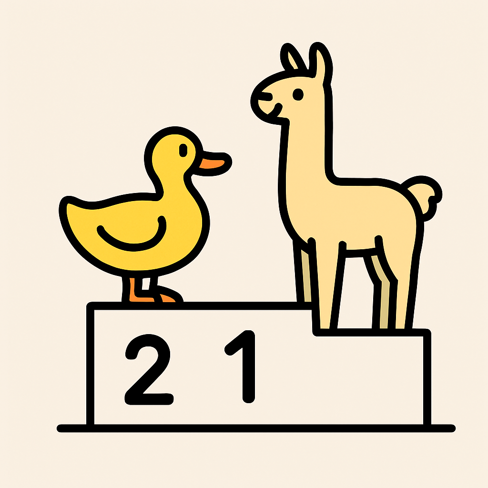

# 🦆 Lamma vs Duck

> 라마와 오리가 펼치는 귀여운 동물 테마 미니게임 플랫폼

[](https://lamma-vs-duck.vercel.app)
[](https://nextjs.org)
[](https://typescriptlang.org)
[](https://supabase.com)

**🌐 서비스 링크**: [lamma-vs-duck.vercel.app](https://lamma-vs-duck.vercel.app)
**📣 프로덕트 소개**: [Disquiet - Lamma vs Duck V2](https://disquiet.io/product/lamma-vs-duck-v2)

---

## 📖 프로젝트 소개

**Lamma vs Duck**은 귀여운 동물 캐릭터들이 등장하는 캐주얼 미니게임 플랫폼입니다.

- 🎮 **3가지 고유한 미니게임** — 퍼즐, 디펜스, 레이싱 장르를 한 곳에서
- 🏆 **매일 도전하는 데일리 챌린지** — 하루 한 번 플레이 후 리더보드 경쟁
- 👤 **게스트 / 로그인 모드** — 로그인 없이도 바로 게임 가능
- 📊 **실시간 랭킹 & 통계** — 편차 그래프와 함께 내 점수 위치 확인

---

## 🎮 게임 소개

### 1. 🦙 Lamma vs Duck — 그리드 퍼즐

| | |
|---|---|
| **장르** | 그리드 기반 퍼즐 |
| **컨트롤** | 방향키 (←→↑↓) |
| **목표** | 같은 동물끼리 모아서 한 종류를 모두 제거 |
| **승리 조건** | 오리🦆 또는 라마🦙 타일을 모두 없애기 |

행과 열을 밀어서 같은 동물끼리 모으는 퍼즐 게임입니다. 가장자리로 밀려난 타일은 반대쪽으로 순환하며 들어옵니다. **클리어 시간이 짧을수록 높은 랭킹**을 기록합니다.

---

### 2. 🐝 Greedy Bee — 디펜스 액션

| | |
|---|---|
| **장르** | 실시간 디펜스 / 서바이벌 |
| **엔진** | Phaser 3 |
| **목표** | 몰려오는 적들을 피하며 최대한 높은 점수 획득 |
| **특징** | 15초마다 난이도 상승, 물리 기반 충돌 판정 |

초록 배경의 게임 필드에서 적들의 공격을 피하며 버티는 서바이벌 게임입니다. **생존 시간이 길수록 더 높은 점수**를 획득합니다.

---

### 3. 🚗 Carrock — 레이싱 액션

| | |
|---|---|
| **장르** | 수평 스크롤 레이싱 |
| **엔진** | Phaser 3 |
| **목표** | 오토바이🏍️를 피하며 버섯 아이템을 먹어 점수 획득 |
| **특징** | 스크롤 배경, 타이어 흔적 파티클, 버섯 파워업 |

사막 트랙에서 자동차를 조종해 쫓아오는 오토바이들을 피하고 버섯 아이템을 수집하는 레이싱 게임입니다. **높은 점수일수록 높은 랭킹**을 기록합니다.

---

## 🖼️ 스크린샷

### 홈 화면


### 게임 프리뷰 애니메이션
| Lamma vs Duck | Greedy Bee |
|:---:|:---:|
|  |  |

---

## 🛠️ 기술 스택

### Frontend
| 기술 | 버전 | 용도 |
|------|------|------|
| [Next.js](https://nextjs.org) | 15 | App Router, SSR/SSG |
| [React](https://react.dev) | 19 | UI 컴포넌트 |
| [TypeScript](https://typescriptlang.org) | 5 | 정적 타입 |
| [TailwindCSS](https://tailwindcss.com) | 4 | 스타일링 |
| [Phaser 3](https://phaser.io) | 3 | 액션 게임 엔진 |
| [Framer Motion](https://www.framer.com/motion/) | - | 애니메이션 |

### State & Data
| 기술 | 용도 |
|------|------|
| [Zustand](https://zustand-demo.pmnd.rs) | 게임 상태 관리 |
| [TanStack Query](https://tanstack.com/query) | 서버 상태 캐싱 및 동기화 |

### Backend & Infrastructure
| 기술 | 용도 |
|------|------|
| [Supabase](https://supabase.com) | PostgreSQL DB, Auth, Realtime |
| [Google OAuth](https://developers.google.com/identity) | One Tap 소셜 로그인 |
| [Vercel](https://vercel.com) | 배포 및 Edge Functions |
| [PostHog](https://posthog.com) | 사용자 행동 분석 |

### Testing & Quality
| 기술 | 용도 |
|------|------|
| [Vitest](https://vitest.dev) | 단위 테스트 |
| [React Testing Library](https://testing-library.com) | 컴포넌트 테스트 |
| [ESLint](https://eslint.org) + [Prettier](https://prettier.io) | 코드 품질 |

### UI Components
- [Shadcn/ui](https://ui.shadcn.com) + [Radix UI](https://www.radix-ui.com) — 접근성 기반 컴포넌트
- [Lucide React](https://lucide.dev) — 아이콘

---

## 🏗️ 아키텍처

### Feature-Sliced Design (FSD) 패턴

```
src/
├── app/              # 앱 전역 설정, Provider, QueryClient
├── entities/         # 핵심 비즈니스 엔티티
│   ├── duck-vs-lamma/    # 보드 로직 (Board 클래스, 이동 알고리즘)
│   ├── account/          # 사용자 계정
│   ├── game/             # 게임 메타데이터
│   └── cross-pad/        # 방향 컨트롤 타입
├── features/         # 재사용 가능한 기능 단위
│   ├── game/             # 게임 데이터 API 훅 (TanStack Query)
│   ├── health-bar/       # 체력 바 컴포넌트
│   ├── score-board/      # 점수 표시
│   └── cross-pad/        # 화살표 방향 컨트롤 UI
├── widgets/          # 독립적인 복합 UI 블록
│   ├── duck-vs-lamma/    # 라마vs오리 게임 위젯
│   ├── fense-wall/       # Greedy Bee 게임 위젯
│   ├── carrock/          # Carrock 게임 위젯
│   ├── leader-board/     # 리더보드 위젯
│   ├── deviation-graph/  # 점수 편차 그래프
│   └── score-result/     # 게임 결과 표시
├── page/             # 페이지별 컴포넌트 조합
│   ├── home/
│   ├── game/
│   ├── result/
│   └── profile/
└── shared/           # 공통 유틸리티, UI, 설정
    ├── ui/
    │   └── game-animations/   # 홈 화면용 프리뷰 애니메이션
    ├── util/
    └── config/theme/          # 커스텀 컬러 팔레트
```

### 디렉토리 전체 구조

```
lamma-vs-duck/
├── app/                    # Next.js App Router
│   ├── page.tsx            # 랜딩 페이지 (마케팅)
│   ├── home/page.tsx       # 게임 선택 대시보드
│   ├── game/[gameId]/      # 게임 플레이 페이지
│   ├── result/[gameId]/    # 게임 결과 페이지
│   ├── profile/            # 사용자 프로필
│   └── api/game/           # API 라우트
├── src/                    # 소스 코드 (FSD 구조)
├── components/ui/          # Shadcn/ui 컴포넌트
├── utils/supabase/         # Supabase 클라이언트 (브라우저/서버/관리자)
├── types/                  # Supabase에서 생성된 TypeScript 타입
├── sqls/                   # DB 스키마 및 마이그레이션
└── public/                 # 정적 에셋 (GIF, 이미지)
```

### 게임 아키텍처

#### Duck vs Lamma (React 기반)
```
Board 클래스 (entities) → Zustand Store (widgets) → React 컴포넌트
```
- 순수 TypeScript로 구현된 `Board` 클래스가 모든 이동 로직 담당
- Zustand 스토어가 게임 상태(현재 보드, 점수, 타이머) 관리
- 세션 스토리지를 통한 게임 중단/재개 지원

#### Phaser 게임 (Greedy Bee, Carrock)
```
Phaser Scene (게임 로직) ↔ React 컴포넌트 (UI 오버레이)
```
- Phaser 3가 캔버스 렌더링과 물리 엔진 담당
- React 컴포넌트가 체력 바, 점수판 등 UI 오버레이 표시
- 게임 이벤트를 통해 Phaser ↔ React 간 상태 동기화

### 데이터 흐름

```
Supabase DB
    │
    ├── 게임 목록/보드 데이터 → TanStack Query 캐싱 → React 컴포넌트
    │
    ├── 게임 결과 제출 → Next.js Server Action → Supabase 저장
    │
    └── 리더보드 조회 → TanStack Query 자동 갱신 (게임 완료 후)
```

---

## 🗄️ 데이터베이스 스키마

- **게임 정의** — 게임 ID, 규칙 설명, 점수 정렬 방식 (오름차순/내림차순)
- **게임 보드** — 일별 생성되는 게임 초기 상태 데이터
- **게임 결과** — 사용자별 점수 기록 (시간 또는 점수)
- **사용자 프로필** — Supabase Auth 연동 프로필

---

## 🚀 개발 환경 시작

### 필수 요구사항
- Node.js 18+
- [pnpm](https://pnpm.io) 9+
- [Supabase CLI](https://supabase.com/docs/guides/cli)

### 설치 및 실행

```bash
# 의존성 설치
pnpm install

# 환경 변수 설정
cp .env.example .env.local
# .env.local에 Supabase 프로젝트 URL과 API 키 입력

# 개발 서버 실행 (Turbopack)
pnpm dev
```

`http://localhost:3000` 에서 확인하세요.

### 주요 개발 명령어

```bash
pnpm dev          # 개발 서버 (Turbopack)
pnpm build        # 프로덕션 빌드
pnpm lint         # ESLint 실행
pnpm typecheck    # TypeScript 타입 검사
pnpm format       # Prettier 코드 포맷
pnpm test         # Vitest 테스트 실행
pnpm test:watch   # 테스트 워치 모드
pnpm test:ui      # Vitest UI
pnpm update-types # Supabase 스키마에서 TypeScript 타입 생성
```

### Supabase 로컬 개발

```bash
supabase start    # 로컬 Supabase 인스턴스 시작
supabase db push  # 마이그레이션 적용
```

---

## 📁 환경 변수

```env
NEXT_PUBLIC_SUPABASE_URL=
NEXT_PUBLIC_SUPABASE_ANON_KEY=
SUPABASE_SERVICE_ROLE_KEY=
NEXT_PUBLIC_POSTHOG_KEY=
NEXT_PUBLIC_POSTHOG_HOST=
```

---

## 🎨 디자인 시스템

- **포스트잇 미학** — 따뜻한 색감의 카드와 독특한 그림자 효과
- **유리 효과 (Glassmorphism)** — 게임 카드 UI에 적용된 반투명 효과
- **커스텀 컬러 팔레트** — `src/shared/config/theme/colors.ts`에서 관리
- **다크/라이트 모드** — 테마 토글 지원

---

## 🤝 기여하기

1. 이 레포지토리를 Fork합니다
2. 새 브랜치를 생성합니다 (`git checkout -b feature/amazing-feature`)
3. 변경사항을 커밋합니다 (`git commit -m 'feat: Add amazing feature'`)
4. 브랜치에 Push합니다 (`git push origin feature/amazing-feature`)
5. Pull Request를 열어주세요

---

## 📜 라이선스

MIT License — 자세한 내용은 [LICENSE](LICENSE) 파일을 참조하세요.

---

<div align="center">

Made with ❤️ by the Lamma vs Duck team

[🌐 Play Now](https://lamma-vs-duck.vercel.app) · [📣 Product Hunt](https://disquiet.io/product/lamma-vs-duck-v2)

</div>
